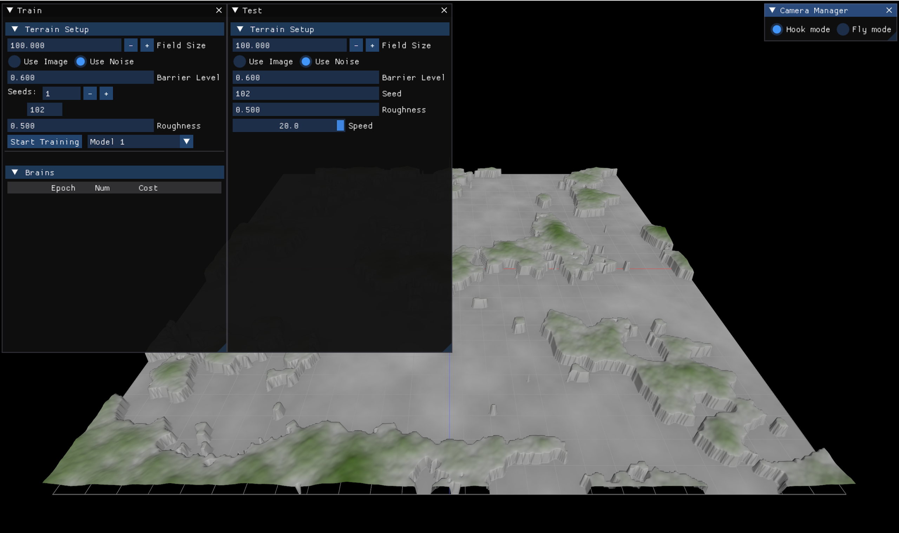
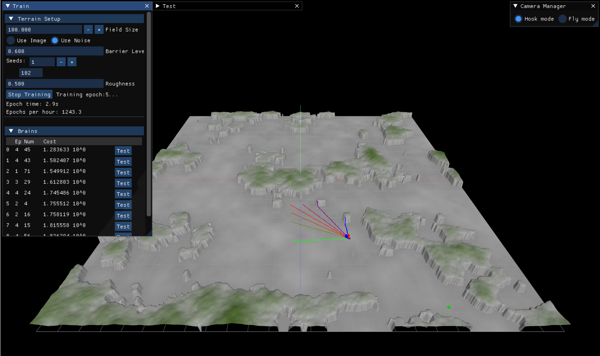
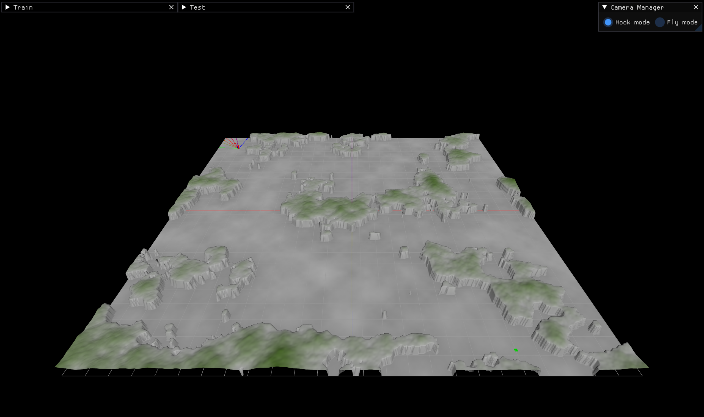
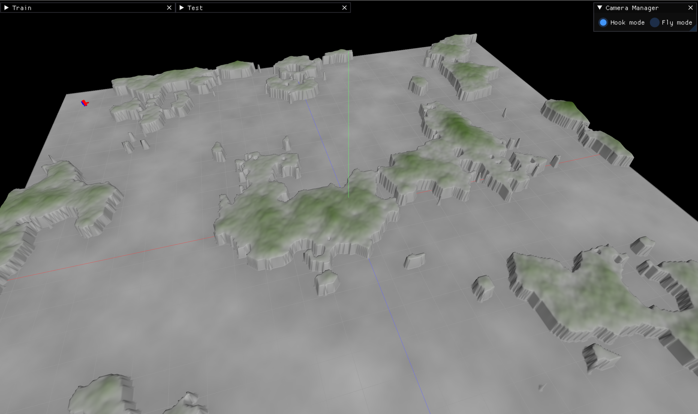

# Path Finding Neural Networks

Application finding the shortest path using neural networks and genetic algorithms.

Built together with [@dpasca](https://github.com/dpasca) who developed `Model 1`. 

## Required Tools

- Git
- CMake
- clang
- Fortran
- HDF5
- OpenGL
- GLEW
- GLFW
- Dear ImGui
- implot

## Getting Started

To get started with the path finding:

1. Clone the repository:
   ```
   git clone https://github.com/azimonti/path-finding-nn
   ```
2. Navigate to the repository directory:
   ```
   cd path-finding-nn
   ```
3. Initialize and update the submodules:
  ```
  git submodule update --init --recursive
  ```

Further update of the submodule can be done with the command:
  ```
  git submodule update --remote
  ```

4. Compile the libraries in `ma-libs`
  ```
  cd externals/ma-libs
  # optional steps if dependencies are not installed globally
  # ./manage_dependency_libraries.sh -d
  # ./manage_dependency_libraries.sh -b
  ./cbuild.sh --build-type Debug --cmake-params "-DCPP_LIBNN=ON -DCPP_LIBGRAPHIC_ENGINE=ON"
  ./cbuild.sh --build-type Release --cmake-params "-DCPP_LIBNN=ON -DCPP_LIBGRAPHIC_ENGINE=ON"
  cd ../..
  ```

  If any error or missing dependencies please look at the instructions [here](https://github.com/azimonti/ma-libs)

5. Compile the binaries
  ```
  ./cbuild.sh -t Release (or -t Debug)
  ```

6. Run the program
  ```
  ./build/Release/path-finding
  ```

## Screnshots

### Starting position



### Start training




### Goal reached




