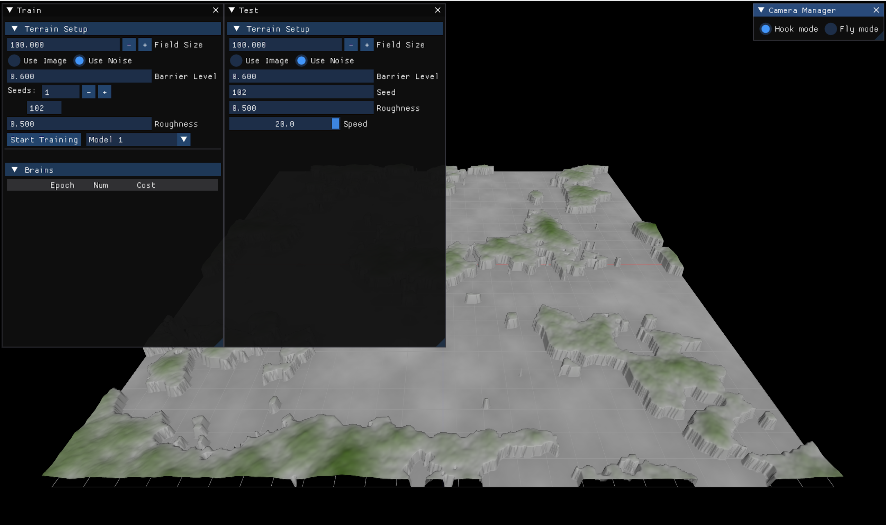
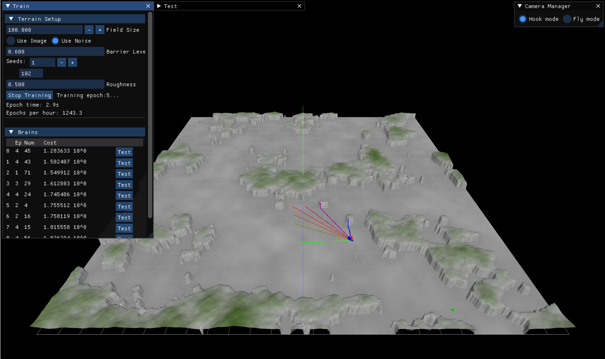
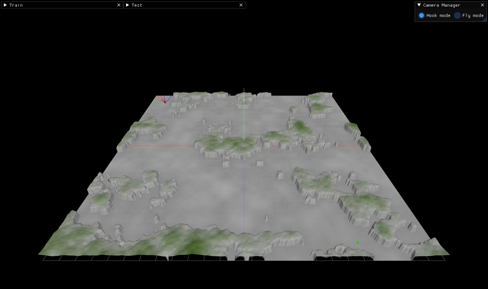
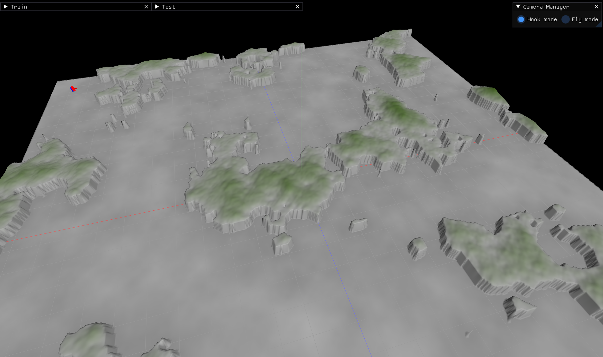

# Path Finding Neural Networks

Application finding the shortest path using neural networks and genetic algorithms.

Built together with [@dpasca](https://github.com/dpasca) who developed `Model 1`.

## Required Tools

- Git
- CMake
- clang
- Fortran
- HDF5
- OpenGL
- GLEW
- GLFW
- Dear ImGui
- implot

## Getting Started

To get started with the path finding:

1. Clone the repository:
   ```
   git clone https://github.com/azimonti/path-finding-nn
   ```
2. Navigate to the repository directory:
   ```
   cd path-finding-nn
   ```
3. Initialize and update the submodules:
  ```
  git submodule update --init --recursive
  ```

Further update of the submodule can be done with the command:
  ```
  git submodule update --remote
  ```

4. Compile the binaries and the libraries
  ```
  ./build_libs.sh
  ```

  If any error or missing dependencies please look at the instructions [here](https://github.com/azimonti/ma-libs)

5. Run the programs
  ```
  ./externals/ma-libs/build/Release/path-finding
  ```

## Screnshots

### Starting position



### Start training




### Goal reached





## Contributing

Contributions to the Path Finding Neural Networks project are welcome. Whether it's through submitting bug reports, proposing new features, or contributing to the code, your help is appreciated. For major changes, please open an issue first to discuss what you would like to change.

## License

This project is licensed under the MIT License - see the [LICENSE](LICENSE) file for details.

## Contact

If you have any questions or want to get in touch regarding the project, please open an issue or contact the repository maintainers directly through GitHub.
